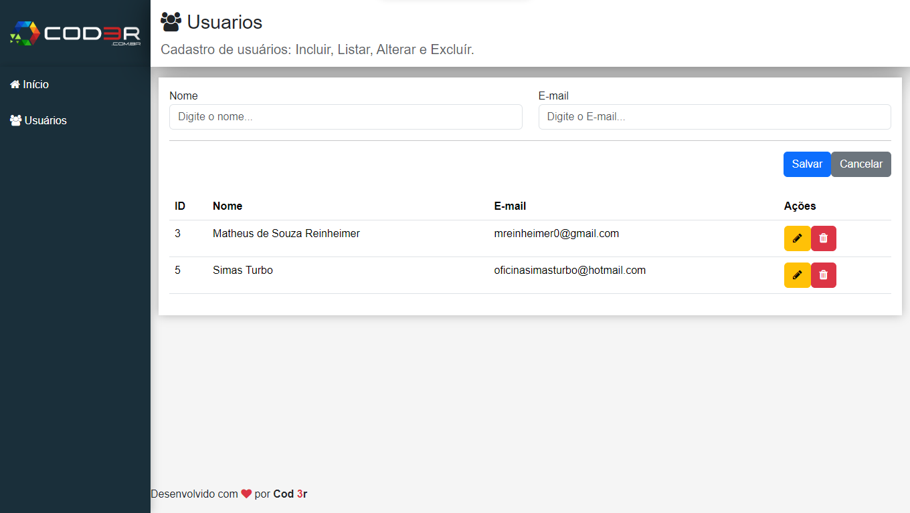

# Users CRUD
  
***Developed in @cod3r's Web Moderno course!***  
> User registration system with four operations (Create, Read, Update, Delete) from the database.

> Status: Finished... ✅ 
## Technologies 🚀

## License 📝

## LINKS 🔗

